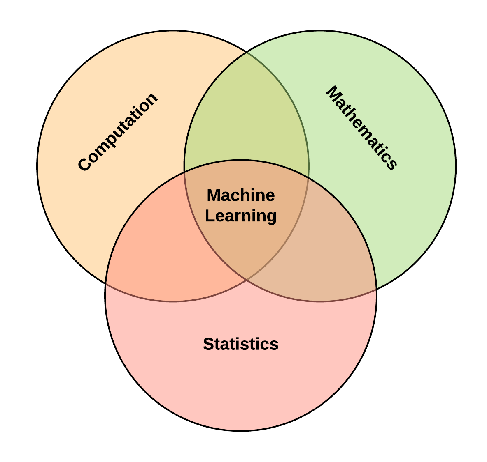

# Machine Learning: An Overview

Table of contents:

- [Why Machine Learning?](#why-machine-learning)
- [How do we assess learning?](#how-do-we-assess-learning)
- [Types of Learning](#types-of-learning)
- [Foundations of Machine Learning](#foundations-of-machine-learning)

**Goal:** Teach the machine to learn based on the input they receive from the Environment.

> Tom Mitchell (1997) defines machine learning as the ability for a machine to gain expertise on a particular task based on experience.

### Why Machine Learning?
- **Solving complexity:** Excels in building computational engines to solve task that cannot possibly be explicitly programmed.
- Examples include natural language understanding, speech recognition and facial recognition.

### How do we assess learning?
Assume a teacher teaches a physics class for three months, and at the end of the lecture sessions, the teacher administers a test to ascertain if the student has learned.

Let us consider two different sub-plots:
1. The teacher tests the student with an exact word for word replica of questions that he used as examples while teaching.
2. The teacher evaluates the student with an entirely different but similar problem set based on the principles taught in class.
In which of the subplots can the teacher be confident that the student has learned?

**Norms of Learning**
1. **Memorization:** Memorization is the act of mastering and storing a pattern for future recollection. Therefore it is inaccurate to use training samples to carry out learning evaluation. In machine learning, this is also known as data snooping.
2. **Generalization:** The ability for the student to extrapolate using the principles taught in class to solve new examples is known as Generalization.
Hence, we can conclude that learning is the ability to generalize to new cases.

### Types of Learning
Machine Learning can be categorized into (at least) three components based on its approach.

The three predominant schemes of learning are:
- Supervised,
- Unsupervised, and
- Reinforcement Learning

**Supervised Learning**
- Each data point is associated with a label
- **Goal:** Teach the computer using this labeled data.
- **Learning:** The computer learns the patterns from data.
- **Inference:** Makes decisions about "unknown" samples.

**Unsupervised Learning**
- No corresponding labels - no guidance.
- **Goal:** Computer attempts to determine data's unknown structure.
- **Scheme:** By "grouping" similar samples together adaptively.

**Reinforcement Learning**
- Reinforcement Learning: Agent interacts with an Environment.
- **Scheme:** A "feedback configuration".
- **Method:** Chooses an action from the set of actions/
- **Learning:** Based on the responses from the Environment.

### Foundations of Machine Learning
The foundational disciplines that contribute to the field of machine learning are:

- Statistics,
- Mathematics,
- The Theory of Computation, and to a considerable extent
- Behavioral Psychology

The diagram below visually shows the interaction between these fields.

### A Formal Model for Machine Learning Theory
ABCD