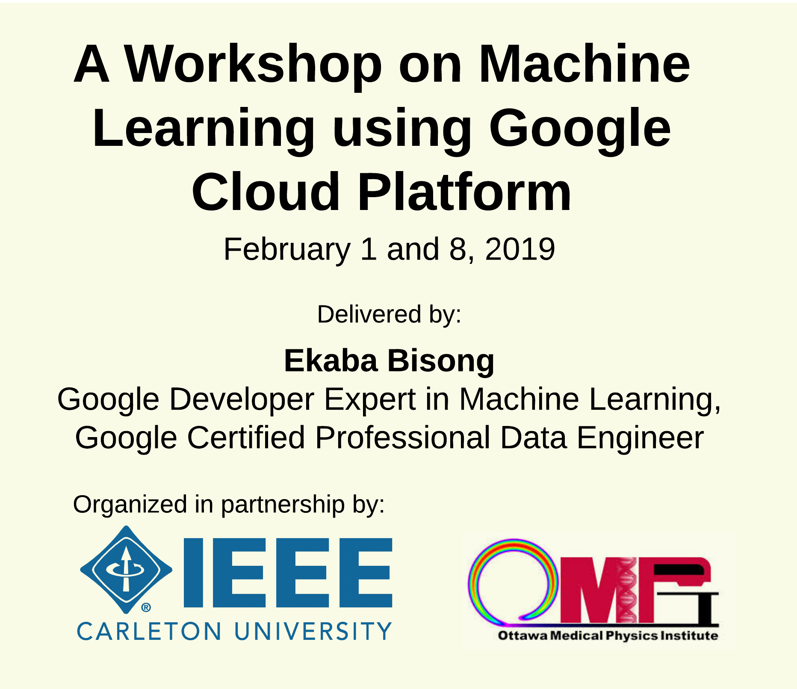

# IEEE Carleton and OMPI Machine Learning Workshop

<!-- 

    

 -->

<!-- | Title         | A Workshop on Machine Learning using Google Cloud Platform |
| ------------- | ---------------------------------------------------------- |
| Date          | February 1 and 8, 2019  |
| Presenter     | Ekaba Bisong,  Google Developer Expert in Machine Learning  Google Certified Professional Data Engineer  | -->

| | |
|-|-|
|__Title__| A Workshop on Machine Learning using Google Cloud Platform
|__Date__ | February 1 and 8, 2019
|__Presenter__ | __Ekaba Bisong__  Google Developer Expert in Machine Learning  Google Certified Professional Data Engineer

The goal of this workshop is to survey the field of machine learning and deep learning. It includes the steps for architecting and deploying a large-scale learning pipeline on Google Cloud Platform.

# Contents:
This workshop contains the following section:
- <a href="./intro-gcp.ipynb">An Introduction to Google Cloud Platform (GCP)</a>
- <a href="./setting-up-gcp.ipynb">Steps to set-up an account on GCP</a>
- <a href="./datalab.ipynb">Working with Google Cloud Datalab</a>
- 
- <a href="./ml-overview.ipynb">An Overview of Machine Learning</a>
- <a href="./linear_regression.ipynb">Linear Regression</a>
- <a href="./logistic_regression.ipynb">Logistic Regression</a>
- <a href="./deep_learning.ipynb">Introducting Deep Learning</a>
- <a href="./dataflow.ipynb">Large Scale Data transformation with Google Cloud Dataflow</a>
- <a href="./cloud-mle.ipynb">Training and Inference at scale with Google Cloud Machine Learning Engine</a>

# Organizers:

    
    

